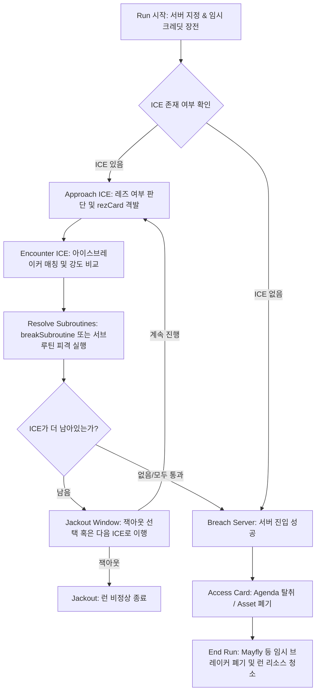

# Android Netrunner 2.0 Web Application Architecture

본 문서는 **Android Netrunner** 웹 애플리케이션의 전체적인 디렉토리 구조, 게임 상태 설계, 룰 엔진의 작동 방식, AI 의사결정 트리, 그리고 QA 시스템 및 오디오 신디사이저 아키텍처를 상세히 기술합니다.

---

## 1. 개요 (Overview)
본 프로젝트는 클래식 비대칭 카드게임인 *Android: Netrunner*의 핵심 메커니즘을 웹 상에서 구현한 시뮬레이터이자 플레이어블 웹 애플리케이션입니다. 

- **Frontend Tech**: React + TypeScript + Vite + TailwindCSS
- **Visual Design**: Cyberpunk FUI (Futuristic User Interface) 테마, 네온 애니메이션, 글래스모피즘
- **Audio System**: Web Audio API 기반의 완전 무의존성 실시간 오디오 합성 신디사이저
- **Engine Rules**: NetrunnerDB API 팩션 및 카드 명세를 기준한 완전 동적 상태 연산 엔진

---

## 2. 디렉토리 구조 및 핵심 모듈 (Directory Structure)

```markdown
Andriod Netrunner/
├── ARCHITECTURE.md          # [NEW] 전체 아키텍처 가이드 명세
├── index.html               # 웹 애플리케이션 HTML 템플릿
├── vite.config.ts           # Vite 번들러 설정 파일
├── src/
│   ├── main.tsx             # React 앱 진입점
│   ├── App.tsx              # 게임 생명주기 및 모달/오버레이 중앙 상태 관리자
│   ├── index.css            # 글로벌 스타일시트 및 네온/글리치 Keyframes 정의
│   ├── assets/              # 정적 그래픽 에셋
│   ├── components/          # 시각적 뷰 컴포넌트 목록
│   │   ├── Board.tsx        # 비대칭적 레이아웃의 메인 게임 보드
│   │   ├── CardComponent.tsx# 카드 렌더링, 툴팁 확대, 카운터/Rez 표기
│   │   ├── RunPanel.tsx     # 런(Run) 단계별 제어 및 상호작용 제어 패널
│   │   ├── LogPanel.tsx     # 게임 기록 콘솔 터미널
│   │   ├── HelpPanel.tsx    # 단축키 및 Netrunner 게임 규칙 도움말
│   │   └── QAPanel.tsx      # QA 테스트 시나리오 실시간 모니터 및 검증기
│   └── game/                # 규칙 연산 엔진 및 AI 모델
│       ├── types.ts         # GameState, Card, RunState 등의 TypeScript 스키마 정의
│       ├── cards.ts         # 카드 데이터베이스 및 팩션별 스타터 덱 정의
│       ├── engine.ts        # 핵심 룰 연산, 턴 진행, 카드 장착 및 런 실행 전이 함수
│       ├── ai.ts            # Corp 및 Runner 반응형 AI 의사결정 휴리스틱
│       ├── sound.ts         # Web Audio API 실시간 파형/음원 합성 플레이어
│       ├── qa.ts            # 상태 유효성 및 Invariant 규칙 교차 검증기
│       └── qa_scenarios.ts  # 43가지 카드 역학 및 코너케이스 통합 QA 테스트 스위트
```

---

## 3. 게임 상태 설계 (State Design & Flow)

전체 게임 상태는 하나의 불변 객체인 `GameState`(`src/game/types.ts`)로 모델링되며, 매 턴과 이벤트마다 순수 함수를 거쳐 새로운 상태로 전이됩니다.

### GameState 주요 스키마 구성
- **`activePlayer`**: 현재 차례를 소유한 플레이어 (`'Corp'` | `'Runner'`)
- **`phase`**: 게임 진행 상태 (`'corp-action'` | `'runner-action'` | `'encounter'` | `'hb-retrieve-card'` 등)
- **`corp` / `runner`**: 각 플레이어별 리소스(클릭 `clicks`, 크레딧 `credits`, 득점 `score`, 손패 `hand`, 덱 `deck`, 버린 카드 `discard`)를 격리하여 관리하는 서브 상태
- **`servers`**: HQ, R&D, Archives 및 Remote 서버들의 물리적 구조 및 해당 서버에 배치된 ICE 배열과 루트(`root`) 내부 카드 목록 관리
- **`run`**: 현재 런(Run)이 진행 중일 때, 조우 중인 ICE 상태, 잭아웃 가부 플래그, 바이러스 카운터, 임시 강도 펌핑량 등을 기록하는 동적 런 컨텍스트

### 데이터 전이 원칙
- **상태 복제 (Immutability)**: 모든 연산 이전에 `cloneState(state)`를 호출하여 객체의 완전한 깊은 복사본을 생성하고 조작합니다.
- **단방향 데이터 흐름**: 사용자 입력 및 AI 틱이 `engine.ts`의 액션 함수들을 격발하고, 반환된 새 `GameState`가 React UI 최상위 상태에 전달되어 전체 UI가 다시 그려지는 단방향 구조를 지킵니다.

---

## 4. 룰 엔진의 핵심 연산 프로세스 (Rules Engine)

`src/game/engine.ts`는 복잡한 하이브리드 비대칭 룰을 수학적이고 상태 지향적으로 해결합니다.

### A. 동적 메모리(MU) 및 제한 시스템
- **동적 수량 계산**: `refreshRunnerMemory(state)` 유틸리티 함수가 매 설치, 파괴, 정리가 일어날 때마다 호출됩니다.
- **메모리 제한 계산 공식**:
  $$\text{memoryLimit} = 4 \text{ (기본값)} + \sum \text{설치된 Consoles/Hardware (+1 혜택 카드 수)}$$
  $$\text{memoryUsed} = \sum \text{현재 Rig에 설치된 Program들의 memoryCost}$$
- **설치 차단 메커니즘**: 프로그램 설치 시 요구 메모리가 남은 가용 메모리보다 크면 설치 클릭 시점에서 연산이 즉시 캔슬되며 예외 로그를 출력합니다.
- **하드웨어 폐기 처리**: `Retribution` 작전이나 Ansel 1.0 등의 ICE 서브루틴에 의해 콘솔/하드웨어가 폐기되어 `rig`에서 제거되면, `refreshRunnerMemory`에 의해 상한선이 동적으로 하향조정됩니다.

### B. 런 루프 (Run Lifecycle)
런의 전체 단계는 `RunState`에 따라 세밀한 서브루프(Sub-loop)로 나뉩니다:



### C. 태그 및 트레이스 메커니즘
- **Trace 연산**: `Trace[X]`가 격발되면 Corp는 기본 세기 $X$에 추가 크레딧을 베팅하고, Runner는 자신의 Link 수치에 추가 크레딧을 베팅합니다. `Corp 최종세기 > Runner 최종세기`일 경우 Trace가 성립되어 러너에게 태그(Tag)를 발급하거나 뇌 데미지를 입힙니다.
- **Tag 상호작용**: Runner가 태그를 가진 경우, Corp는 클릭과 크레딧을 소모하여 설치된 러너 리소스를 마음대로 폐기할 수 있고 `Retribution` 같은 고화력 작전 카드를 가동할 수 있습니다.

---

## 5. AI 의사결정 모델 (AI Decision Tree Heuristics)

본 애플리케이션은 사용자 대기 시간 없는 부드러운 단인 대전을 위해 휴리스틱 의사결정 모델(`src/game/ai.ts`)을 사용합니다.

### Corp AI 의사결정 흐름
1. **의제 즉시 득점**: 현재 발전 카운터가 요구치를 충족한 서버 루트의 Agenda가 있다면 즉시 `scoreAgenda`를 격발합니다.
2. **자산 Rez**: 턴 시작 시 또는 가용한 크레딧이 충분한 상태에서 `Nico Campaign` 등 Rez가 안 된 경제 자산이 있으면 Rez를 실행합니다.
3. **경제 이득 극대화**: `Regolith Mining License`에 잔여 크레딧이 있다면 클릭을 소모하여 채굴을 진행합니다. 손패에 `Hedge Fund`나 `Government Subsidy`가 있고 지불 능력이 있다면 즉시 가동합니다.
4. **아이스월 강화 및 개발**: 미공개된 의제가 서버에 올라와 있다면 클릭을 소모하여 발전(Advance)시킵니다.
5. **서버 방어**: Runner가 런을 수행할 때 해당 서버에 설치된 ICE 중 미공개 상태인 것을 크레딧 범위 내에서 자동 Rez하여 런을 저지합니다.

### Runner AI 의사결정 흐름
1. **브레이커/하드웨어 전개**: 효율적인 리소스 확보를 우선한 뒤, 덱에서 적합한 아이스브레이커가 식별되면 메모리 한도 범위 내에서 즉시 설치합니다.
2. **자동 브레이커 제어**: ICE와의 조우 시, 현재 보유 중인 브레이커 중 해당 ICE 타입(Barrier, Code Gate, Sentry)에 대응하는 기기를 탐색하여 최적의 부스트 크레딧 연산 및 서브루틴 무력화 베팅을 자동으로 수행합니다.

---

## 6. 시각 연출 및 사이버펑크 테마 시스템 (UI & Aesthetics)

사용자 몰입을 위해 현대적인 네온 사이버펑크(Cyberpunk FUI) 테마를 스타일시트와 애니메이션 상태 트리로 결합했습니다.

### 주요 이펙트 및 CSS Keyframes
- **네온 스캔 라인 (Neon Laser Scan Overlay)**: 성공적인 런 성공 시 화면 중앙에 시안색 광선 스캔 레이저가 아래위로 움직이며 격렬한 침입 성공 무드를 전달합니다.
- **글리치 데미지 플래시 (Glitch & Noise Damage FX)**: 러너가 넷 데미지나 육체 데미지를 피격당할 때 화면 전체가 빨간색 오버레이와 함께 비틀리는 흔들림 애니메이션을 적용해 타격감을 표현합니다.
- **아젠다 입자 확장 이펙트 (Neon Score Particles)**: 득점 및 탈취 성공 시 보드 상단 점수판에 네온 그린/네온 핑크 불꽃 파티클 효과가 나타납니다.
- **글래스모피즘(Glassmorphism) 카드 디자인**: `backdrop-filter: blur(8px)` 속성과 미세한 시안 테두리 광선, 2.5D 마우스 호버 트랜스폼 회전(tilt)을 부여해 미래 지향적인 촉감을 연출합니다.

---

## 7. Web Audio API 기반 오디오 신디사이저 (Sound Synthesizer)

외부 사운드 파일 없이 온전히 코드 기반으로 구동되는 오디오 신디사이저(`src/game/sound.ts`)를 탑재하여 로딩 지연이 없으며 완벽한 오디오 주파수 제어가 가능합니다.

- **BGM 드론 루프**: 저주파 톱니파(Sawtooth) 오실레이터와 $250\text{Hz}$ 로우패스 필터를 믹싱하여 Dm -> F -> C -> Bb 코드 진행을 가진 묵직하고 웅장한 사이버펑크 앰비언스를 연출합니다.
- **노이즈 기반 드럼**: Math.random()을 채워 넣은 오디오 버퍼 소스를 붕괴시켜 하이해트 및 비트 타악기 노이즈를 재현합니다.
- **이벤트별 주파수 합성**:
  - **설치음**: 빠르게 주파수가 치솟는 삼각파 신디사이징 (`frequency.exponentialRampToValueAtTime`)
  - **피격음**: 노이즈와 사각파를 혼합한 불협화음 주파수 감쇠
  - **아젠다 스코어**: 화려한 아르페지오 음계 상승 효과음 재생

---

## 8. 통합 QA 테스트 시스템 (QA Scenario Runner)

애플리케이션의 높은 신뢰성을 담보하기 위해 43가지의 유기적 카드 특성 및 규칙 연산을 격리 테스트하는 자체 QA 라이브러리(`src/game/qa_scenarios.ts`)를 운영하고 있습니다.

- **시나리오 테스트 구성**: 턴의 제어권을 강제로 모킹(Mocking)한 상태에서 `installCard`, `initiateRun` 등의 엔진 API를 직접 호출한 뒤 상태의 속성값 불변성을 `assert()`를 통해 검증합니다.
- **브라우저 테스터 연동**: 플레이어는 실제 게임 도중 언제든 브라우저 우측 하단의 QA 패널을 열어 전체 43개의 테스트 성공 여부를 시각적으로 확인할 수 있으며, 테스트 실행을 눌러 보드 상태를 특정 시나리오의 시점으로 강제 리셋할 수 있습니다.
